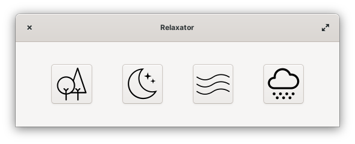

## Relaxator

Relax to soothing sounds



[](https://flathub.org/apps/details/com.github.alexkdeveloper.relaxator)

The application is written using the following libraries:
```
gtk4
libadwaita-1
gstreamer-1.0
```
To build, run the following commands:
```
meson build --prefix=/usr
cd build
ninja
```
To install:
```
ninja install
```
